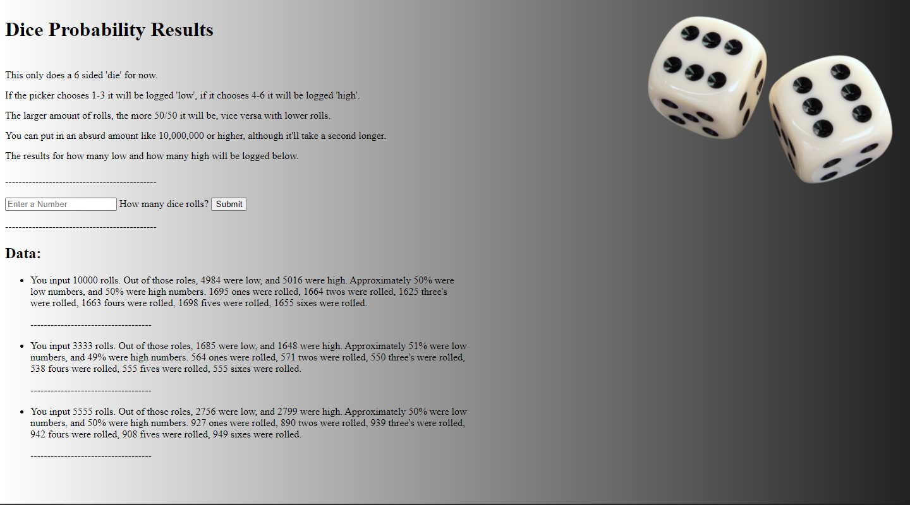

# Simple Dice Roller Website
A simple dice roller website that provides you with way more stats than you'll ever need such as how many of each number was rolled as well as the percentage of high/low numbers rolled. (Low Number = 1-3 / High Number = 4-6) This was a DOM practice for me, so it's not designed well or anything as far as sytling goes.

## The Site in Action:
